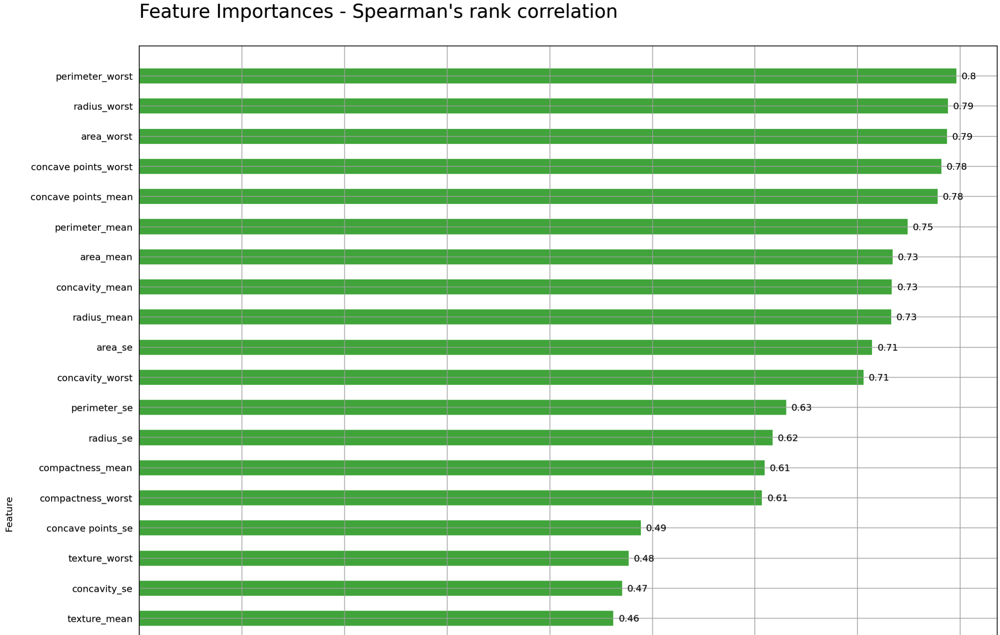
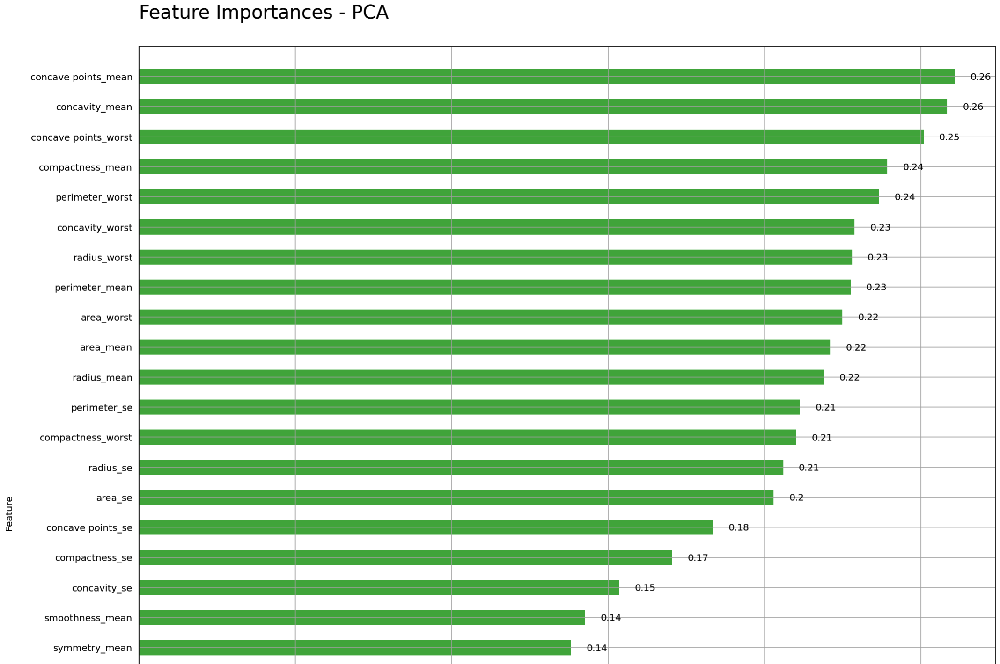
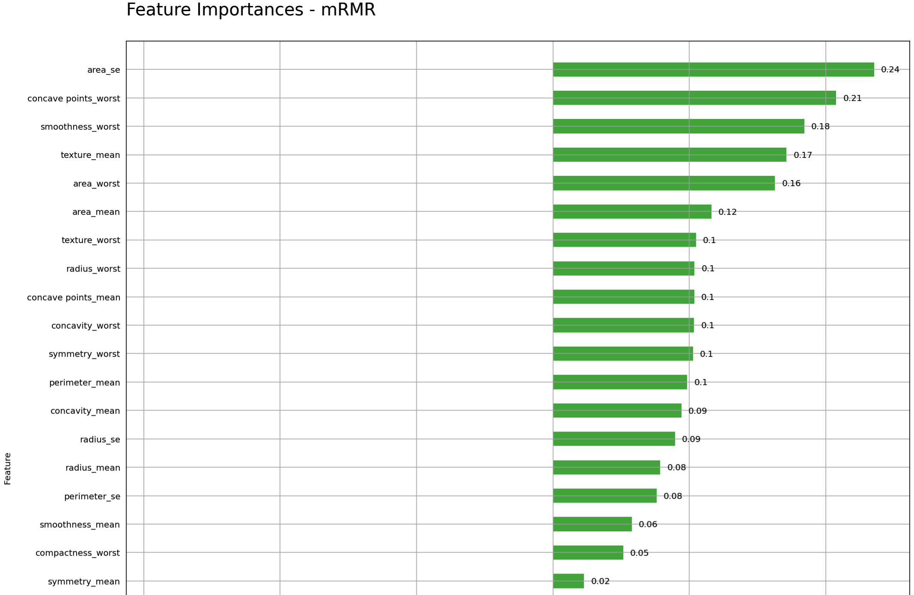
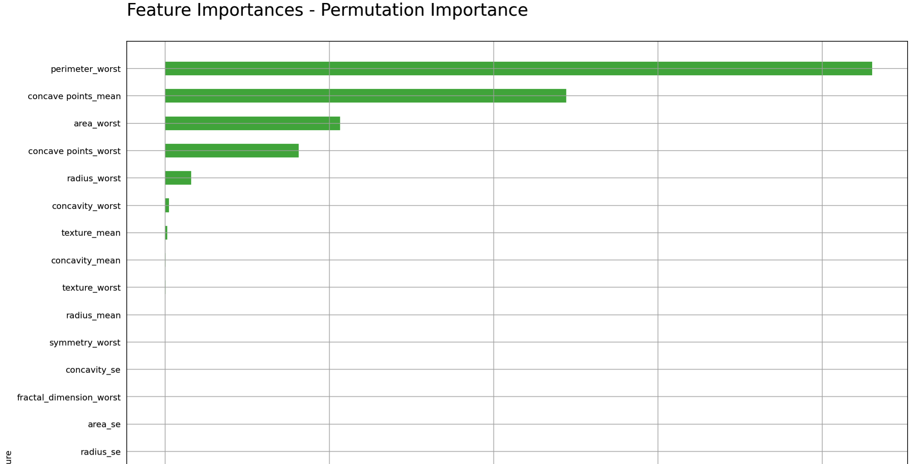
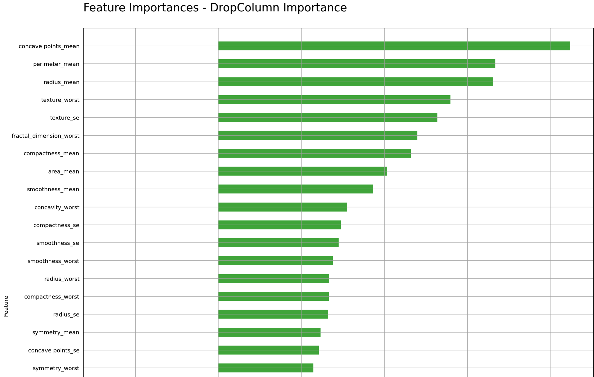
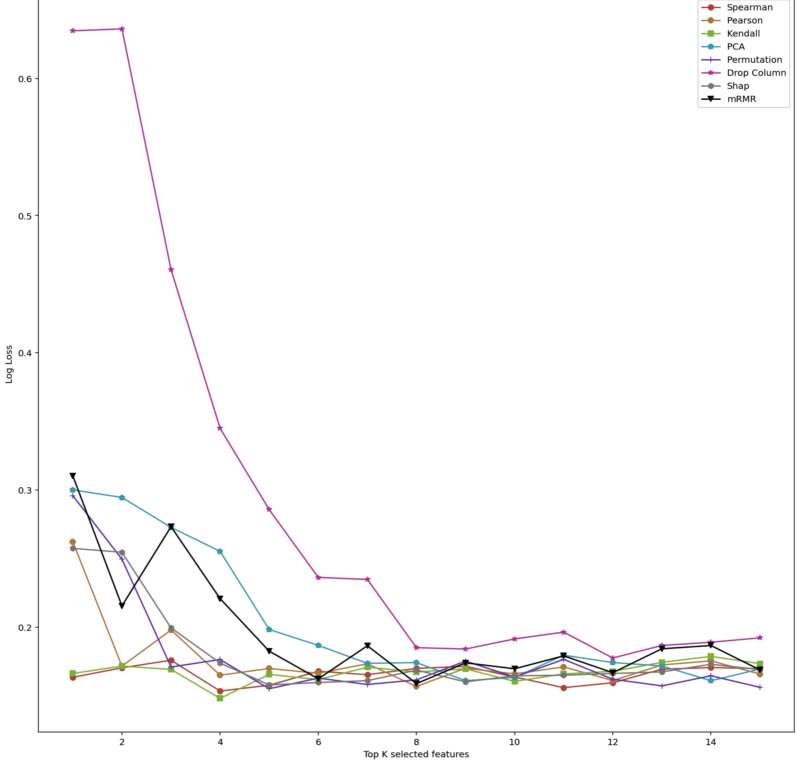
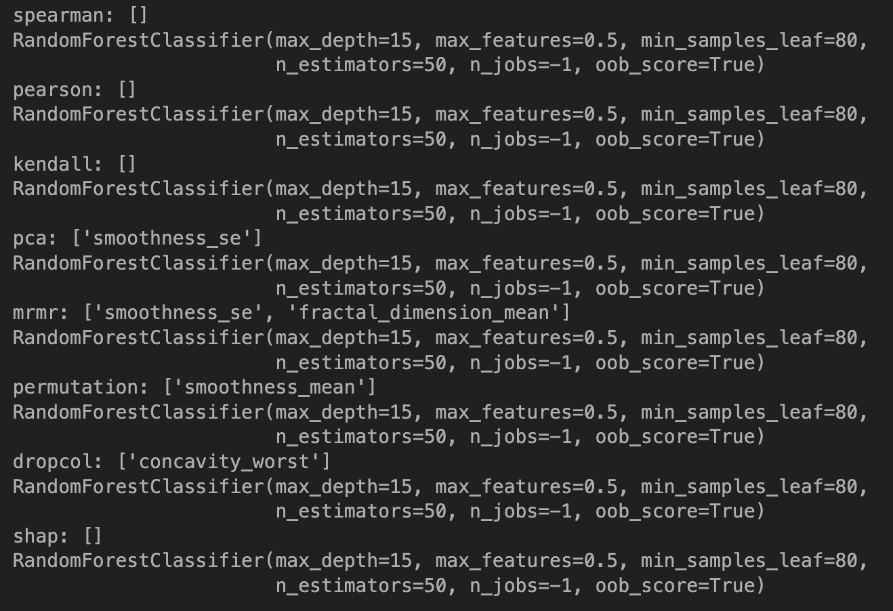
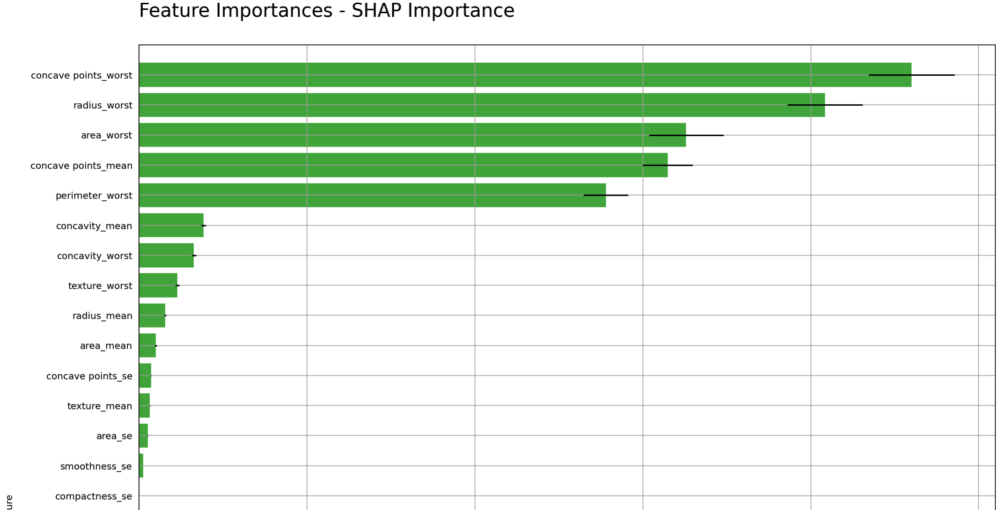
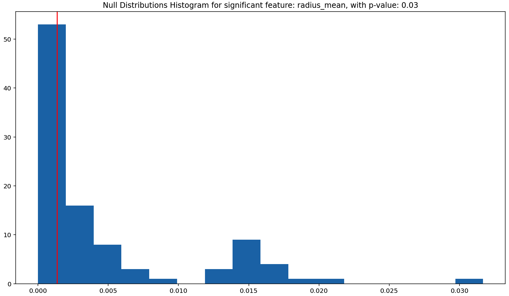
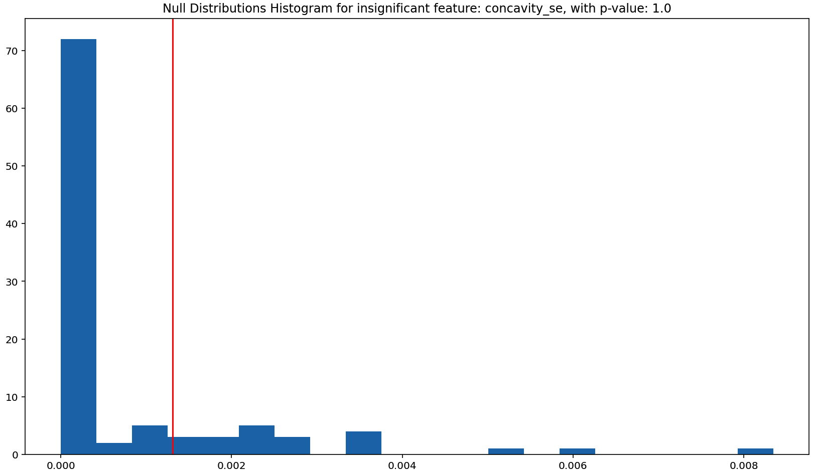

# Automatic Feature Importances & selection

## Intro

Feature importances and selection is a critical topic that helps us to understand how data works on the machine learning algorithm, which can also help us select promising features among the large data.

In this repo, I will introduce several techniques including python code for feature importances and selection:

1. Data-based feature importances strategies
2. Model-based feature importance strategies
3. Automatic comparing strategy for feature importances
4. Automatic feature selection algorithm
5. Variance for feature importances
6. Empirical p-values for feature importances

 

Link to code: [click here](https://github.com/ajinChen/automatic-feature-selection/blob/main/featimp.py).

## Datasets

### Breast Cancer Wisconsin (Diagnostic) Data Set: 

Features are computed from a digitized image of a fine needle aspirate (FNA) of a breast mass. They describe characteristics of the cell nuclei present in the image.

The mean, standard error and "worst" or largest (mean of the three largest values) of these features were computed for each image, resulting in 30 features. For instance, field 3 is Mean Radius, field 13 is Radius SE, field 23 is Worst Radius. 
All feature values are recoded with four significant digits. 

Link to dataset: [click here](https://www.kaggle.com/uciml/breast-cancer-wisconsin-data).

| Factor              | DataType         | Detail                                                   |
| ------------------- | ---------------- | -------------------------------------------------------- |
| `ID number`         | Numeric          | the image ID                                             |
| **`Diagnosis`**     | Boolean (Target) | 0 = malignant, 1 = benign                                |
| `radius`            | Numeric          | mean of distances from center to points on the perimeter |
| `texture`           | Numeric          | standard deviation of gray-scale values                  |
| `perimeter`         | Numeric          | The perimeter of the core tumor                          |
| `area`              | Numeric          | The area of the core tumor                               |
| `smoothness`        | Numeric          | local variation in radius lengths                        |
| `compactness`       | Numeric          | perimeter^2 / area - 1.0                                 |
| `concavity`         | Numeric          | severity of concave portions of the contour              |
| `concave points`    | Numeric          | number of concave portions of the contour                |
| `symmetry`          | Numeric          | The symmetry of the core tumor                           |
| `fractal dimension` | Numeric          | coastline approximation - 1                              |

The dataset contains:

- 32 features, 569 rows
- Class distribution: 357 benign, 212 malignant

## Data-based Feature Importances Strategies

Data-based importance strategies directly use data to calculate the relationship between features and target. We often use the high relevance and low redundancy of these two indexes to judge if a feature is good or not.

 There are several data-based importance strategies, including:

1. Spearman's rank coefficient
2. Pearson's rank coefficient
3. Kendall Tau rank coefficient
4. Principal component analysis (PCA)
5. Minimal-redundancy-maximal-relevance (mRMR)

The top_rank function in the code wrapped the `Spearman's rank coefficient`, `Pearson's rank coefficient`, `Kendall Tau rank coefficient`, and `Principal component analysis (PCA)`, which can realize each method on the data and get the top k important features.

Users also can visualize the feature importances using a horizontal bar plot from top to bottom with printting the value of importances value on the plot if use `show_values=True`.

### Spearman & Pearson Rank Coefficient

Spearman's rank correlation evaluates the monotonic relationships between each feature and target.
If the Spearman correlation is positive, it indicates that the target tends to increase when X increases. If the Spearman correlation is negative, it indicates that the target tends to decrease when X increases.

Pearson's rank correlation evaluates the linear relationships between each feature and target. The Pearson correlation between two variables is equal to the Spearman correlation.

```python
fea, imp = top_rank(data, 'diagnosis', method='spearman')
plot_feature_importances(imp, fea, "Spearman's rank correlation", show_values=True)
```



### Kendall Tau Rank Coefficient

Kendall’s Tau is a non-parametric measure of relationships based on concordant and discordant pairs between each feature and target in the data, which Kendall Tau correlation coefficient returns a value between 0 to 1.

Kendall’s Tau correlation is usually smaller values than Spearman’s correlation and is insensitive to error.

```python
fea, imp = top_rank(data, 'diagnosis', method='kendall')
plot_feature_importances(imp, fea, "Kendall Tau's rank correlation", show_values=True)
```


### Principal component analysis (PCA)

The principal component analysis is a vital method to rank the feature importances, which operates on just the X explanatory matrix. PCA uses singular value decomposition on data to transform data into a lower-dimensional space, which is characterized by eigenvectors and evaluates each feature by the most variance in the new space.

```python
fea, imp = top_rank(data, 'diagnosis', method='PCA')
plot_feature_importances(imp, fea, 'PCA', show_values=True)
```



### Minimal-redundancy-maximal-relevance (mRMR)

Minimal-redundancy-maximal-relevance is an ideal method to deal with codependencies problems between the features, which measures relevance and low redundancy at the same time.

1. `Relevance`: The coefficient between the individual feature and the target
2. `Redundancy`: The coefficient between each individual feature.

The ideal feature we need should have high relevance and low redundancy, and we can see how the algorithm works when you set the `info=True`.

```python
imp, fea = mRMR(data, 'diagnosis', info=True)
plot_feature_importances(imp, fea, 'mRMR', show_values=True)
```



## Model-based Feature Importance Strategies

Model-based importance strategies use the performance of the model to calculate the relationship between features and target. In this method, we need to train a decent model using 80% of data and evaluate on other 20% of data to judge if a feature is good or not.

```python
train, val = train_val_split(data, 0.8)
x_train, y_train = split_target(train, 'diagnosis')
x_val, y_val = split_target(val, 'diagnosis')
```

There are several model-based importance strategies, including:

1. Permutation importances
2. Drop column importances

I wrapped each of method into individual functions and return the top k importance values and corresponding column name.

### Permutation Importances

The permutation importance method measures the features by the difference of validation loss on validation data before and after the permutation, which don't need to retrain model and can apply to any kind of machine learning algorithm.<br>

Procedure:<br>
a. Compute the baseline on validation metric for a model trained on all features<br>
b. Permute evaluating feature in the validation set<br>
c. Compute validation score on new validation data<br>
d. The importance score is the difference between two validation scores.<br>

However, this method may create nonsensical records through permutation.

```python
imp, feas = permutation_importance(x_train, y_train, x_val, y_val)
plot_feature_importances(imp, feas, 'Permutation Importance')
```



### Drop Column Importances

Drop column importances method measures the features by the difference of validation loss on training data before and after the dropping, which need to retrain model and can examine the importance of any feature or combination of features.<br>

Procedure:<br>
a. Compute the baseline on validation metric for a model trained on all features<br>
b. Drop the feature you want to evaluate from the data set<br>
c. Retrain the model<br>
d. Compute validation loss<br>
e. The importance score is the difference between two validation scores<br>

However, this method needs to retrain the model, which will cost a lot of the data is large. And the codependent features often result in 0.

```python
imp, feas = dropcol_importances(x_train, y_train, x_val, y_val)
plot_feature_importances(imp, feas, 'DropColumn Importance')
```



## Automatic Comparing Strategies for Feature Importance 

Different methods may emphasize different parts of feature importance and we create a function to compare them all. In `compare_Top_k function`, users only needs to send the whole data and target, and it will automatically compare the loss on the model using top k features selected from each method above (data-based and model-based). This function also compares to the feature importances from `SHAP`, which becomes a standard package for feature selection.

Include:
Data-based:

1. Spearman's rank coefficient
2. Pearson's rank coefficient
3. Kendall Tau rank coefficient
4. Principal component analysis (PCA)
5. Minimal-redundancy-maximal-relevance (mRMR)

Model-based:

1. Permutation importances
2. Drop column importances
3. SHAP

```python
compare_Top_k(data, 'diagnosis', 15)
```

 

Procedure:<br>
a. Preprocessing data for model-based and data-based method<br>
b. Calculate the top k features on different methods<br>
c. Calculate different loss on 1 to k features for each method<br>
d. Display all losses on the plot<br>

## Automatic Feature Selection

In this section, I will introduce an automatic feature selection approach that only needs to send the whole data and target and it will return the best model and drop-features list for you. You can choose different methods for you to choose feature importance, including:

1. Spearman's rank coefficient -> `spearman`
2. Pearson's rank coefficient -> `pearson`
3. Kendall Tau rank coefficient -> `kendall`
4. Principal component analysis -> `pca`
5. Minimal-redundancy-maximal-relevance -> `mrmr`
6. Permutation importances -> `permutation`
7. Drop column importances -> `dropcol`
8. SHAP -> `shap`

The basic rule is that we drop the lowest importance until validation loss does not increases, return the previous best model and drop the feature list.

Procedure:<br>
a. Use the method you input to calculate the feature importances<br>
b. Use all features to calculate the baseline validation loss<br>
c. Drop the lowest importance feature<br>
d. Retrain the model and recompute the validation loss<br>
e. If validation loss decreases, we repeat 3, 4<br>
f. Return the best model before the last iteration.<br>

```python
modes = ['spearman', 'pearson', 'kendall', 'pca', 'mrmr', 'permutation', 'dropcol', 'shap']

for mode in modes:
    best_model, feat_drop = auto_featSelection(data, 'diagnosis', mode=mode)
    print(str(mode) + ': ' + str([f for f in feat_drop]))
    print(best_model)
```

 

## Variance for Feature Importances

Variance is also a necessary part of feature selection, which tells us if the feature importances values are stable or not. In this case, we should include the variance info into the feature importances plot, which makes it easy to compare and select the vital features.

We can calculate the variance of feature importances using the bootstrapping method for the model-based feature importances method and add this variance (show_var) to the plot.
My function supports :

1. Permutation importances -> `permutation`
2. Drop column importances -> `dropcol`
3. SHAP -> `shap`

```python
imp, feas = shap_importances(x_train, y_train, x_val, y_val)
var_error = feature_variance(data, 'diagnosis')
plot_feature_importances(imp, feas, 'SHAP Importance', show_var=var_error)
```

 

After fitting the model, we can get feature importance from Random Forest. The result shows that sentimental score is the model important feature in the model. Playtime, Developer, and Price are also important to predict Voted up. Then we tested the best model on the validation set, the accuracy is about 0.97.


## Empirical p-values for Feature Importances

Different from the variance, p_value can tell us more information about feature important distribution and directly tell us about if this feature is significant or not. We can also adapt the bootstrapping method to calculate p_value for features based on the baseline. Then, we can show the histogram distribution plot for features and compare with the position of p_value by setting the value of significant level.

This function also supports the model-based feature importances method:

1. Permutation importances -> `permutation`
2. Drop column importances -> `dropcol`
3. SHAP -> `shap`

```python
p_values, baseline, imps, feas = feature_pvalue(data, 'diagnosis')
pvalue_hist(p_values, baseline, imps, feas, k=0, alpha=0.05)
pvalue_hist(p_values, baseline, imps, feas, k=16, alpha=0.05)
```



The first plot shows us the distribution of a significant feature: radius_mean and corresponding p_value: 0.03
The second plot shows us the distribution of an insignificant feature: concavity_se and corresponding p_value: 1.0
